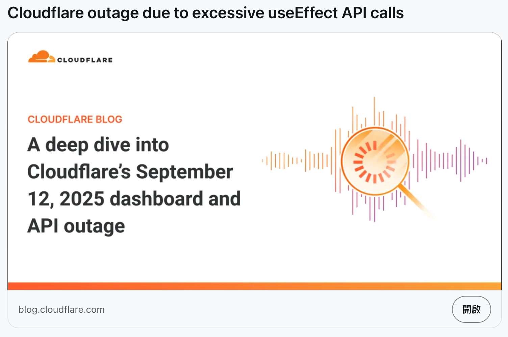
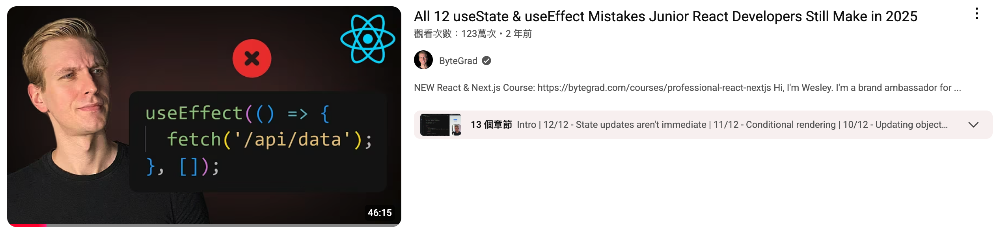
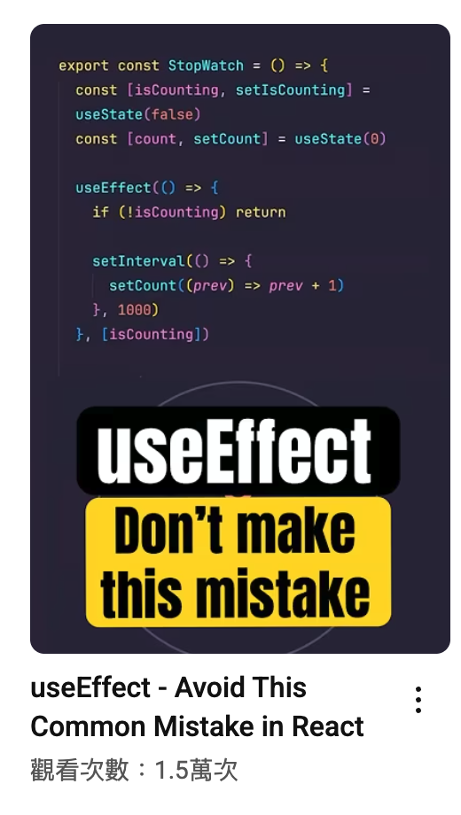
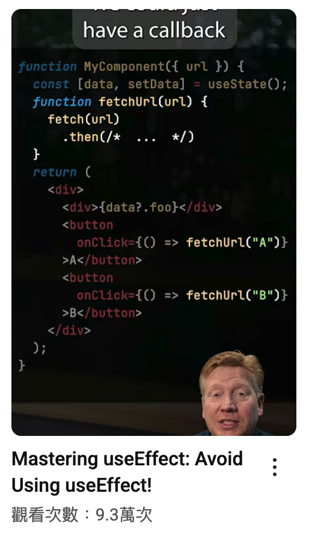
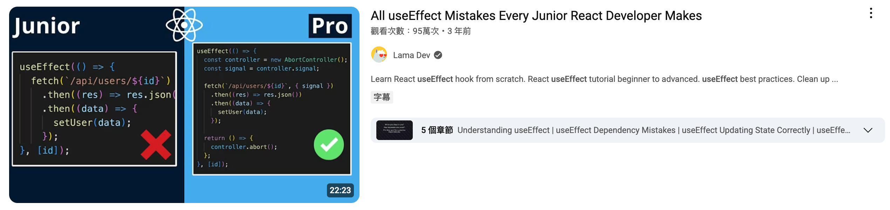
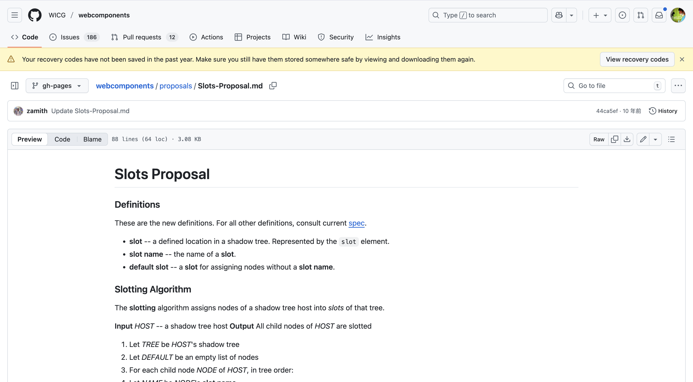

# Webdev Monthly Talk Event 250925
---

# Opening

## Why this? (Webdev monthly talk event)

<div v-click>

* 我剛來的時候還有類似的活動

</div>

<div v-click>

* 隨著主辦人離開暫停了很長的時間

</div>

<div v-click>

* 直到去年我開始有點餘力把這件事撿回來

</div>

<div v-click>

* AI 時代，協作跟分享資訊比起以前任何一個時刻都前所未有的重要

  - 雖然 AI 看似能賦予你前所未有的一人成團隊能力，但是我認為不能跟人好好表達想法的話也很難跟 AI 表達你的意圖
  - 所以這活動除了分享還多了一層目的：訓練各位表達跟陳述的能力

</div>

<div v-click>

* 另外 <span class="line-badge">LINE</span> Japan 的 Engineering Manager 朋朋告訴我，他們類似的聚會一個月辦一次

</div>

<style>

/* LINE badge style */
.line-badge {
  display: inline-block;
  background: linear-gradient(135deg, #00c73c, #00b933);
  color: white;
  font-weight: bold;
  padding: 0.125rem 0.5rem;
  border-radius: 0.375rem;
  font-size: 0.875rem;
  letter-spacing: 0.05em;
  box-shadow: 0 2px 4px rgba(0, 199, 60, 0.3);
  vertical-align: middle;
  margin: 0 0.125rem;
}
</style>
---

# Why Lightning Talk? (CONT.)

<div v-click>

* 準備五分鐘內容比五十分鐘容易 <div class="badge">廢話.jpg</div>
* 有興趣 follow-up 的人給他五分鐘的材料就夠了，五十分鐘很容易左耳進右耳出

</div>

<div v-click>

* 五分鐘其實並不長，請正確清楚地說完該說的事情
  - （後續延伸討論不算在內）

</div>

<div v-click>

* 一個月學習一件事情然後教給別人應該不是一件太困難的事情（？）
  - 或者你已經學好學滿，有無限多可以分享的資訊跟知識，可以跳過學習這個步驟
  - 但無法跳過整理資訊這個步驟

</div>

<div v-click>

* 你教別人一件事然後有十個人教你一件事，很划算吧！

</div>

<style>
.badge {
  display: inline-block;
  background: linear-gradient(135deg, darkblue, #01619b);
  color: white;
  font-weight: bold;
  padding: 0.125rem 0.5rem;
  border-radius: 0.375rem;
  font-size: 0.875rem;
  letter-spacing: 0.05em;
  box-shadow: 0 2px 4px rgba(0, 199, 60, 0.3);
  vertical-align: middle;
  margin: 0 0.125rem;
}
</style>

---

# Lightning Talk Rules

<div v-click>

* 今天不會嚴格倒計時，請自己控制時間

</div>

<div v-click>

* 不過沒刻意練習的話五分鐘其實很難精準，所以今天超時也不會怎麼樣

</div>

<div v-click>

* <del>下次超時幾分鐘就多喝幾杯飲料好了</del>

</div>

<div v-click>

* Let's try it!

</div>

---
layout: cover
---

# Stories

## Alive

---
layout: cover
---

# Story-1

---
layout: center
---



---

# Cloudflare Outage

<div class="quote-container">
  <div class="quote-mark">"</div>
  <blockquote class="styled-quote">
    <p>這次事件的影響源自於多個問題，但直接導火線是儀錶板中的一個 bug。</p>
    <p>該 bug 導致對租用戶服務 API 進行了重複且不必要的呼叫。</p>
    <p>這些 API 呼叫由 React useEffect hook 管理，但我們錯誤地在其依賴項陣列中新增了一個有問題的物件。</p>
    <p>由於每次狀態或 props 變更時都會重新建立此對象，因此 React 會將其視為"始終新的"，從而導致 useEffect 每次都會重新運行。</p>
    <p>結果，在單次儀錶板渲染期間，API 呼叫被執行了多次，而不是僅僅一次。此行為與租戶服務 API 的服務更新同時發生，加劇了不穩定性，最終導致服務不堪重負，最終無法恢復。</p>
  </blockquote>
  <div class="quote-source">— Cloudflare Incident Report</div>
</div>

<style>
.quote-container {
  position: relative;
  margin: 2rem auto;
  max-width: 90%;
}

.quote-mark {
  position: absolute;
  top: -20px;
  left: -20px;
  font-size: 5rem;
  color: #ff6b6b;
  opacity: 0.3;
  font-family: Georgia, serif;
  line-height: 1;
  z-index: 0;
}

.styled-quote {
  position: relative;
  background: linear-gradient(135deg, rgba(255, 107, 107, 0.05), rgba(78, 205, 196, 0.05));
  border-left: 4px solid;
  border-image: linear-gradient(180deg, #ff6b6b, #4ecdc4) 1;
  padding: 1.5rem 2rem;
  margin: 0;
  border-radius: 0 8px 8px 0;
  box-shadow: 0 4px 20px rgba(0, 0, 0, 0.08);
  backdrop-filter: blur(10px);
  z-index: 1;
}

.styled-quote p {
  margin: 0.5rem 0;
  line-height: 1.6;
  color: #2d3748;
  font-size: 0.95rem;
  position: relative;
  z-index: 1;
  animation: fadeIn 0.6s ease-out forwards;
}

.styled-quote p:first-child {
  font-weight: 600;
  color: #1a202c;
}

.quote-source {
  text-align: right;
  margin-top: 1rem;
  font-style: italic;
  color: #718096;
  font-size: 0.875rem;
}

.styled-quote::before {
  content: "";
  position: absolute;
  top: 0;
  right: 0;
  width: 100px;
  height: 100px;
  background: radial-gradient(circle, rgba(255, 107, 107, 0.1), transparent);
  border-radius: 50%;
  transform: translate(30%, -30%);
}

@keyframes fadeIn {
  from {
    opacity: 0;
    transform: translateY(10px);
  }
  to {
    opacity: 1;
    transform: translateY(0);
  }
}

.styled-quote p {
  animation: fadeIn 0.6s ease-out forwards;
}

.styled-quote p:nth-child(1) { animation-delay: 0.1s; }
.styled-quote p:nth-child(2) { animation-delay: 0.2s; }
.styled-quote p:nth-child(3) { animation-delay: 0.3s; }
.styled-quote p:nth-child(4) { animation-delay: 0.4s; }
.styled-quote p:nth-child(5) { animation-delay: 0.5s; }
</style>

---

# Cloudflare Outage (CONT.)

<div v-click>

* 這次事件相關的討論不少，也跟後端佈建有關係

</div>

<div v-click>

* 但我想從純前端的 root cause (`useEffect`) 的角度來看

</div>

<div v-click>

* 我們先看看下面這些圖...

</div>

---


<div class="useeffect-gallery">
  <div class="gallery-item">
    
    <div class="gallery-caption">ByteGrad: 12 Common Mistakes</div>
  </div>
  <div class="gallery-item">
    
    <div class="gallery-caption">Don't Make This Mistake</div>
  </div>
  <div class="gallery-item">
    
    <div class="gallery-caption">Mastering useEffect</div>
  </div>
  <div class="gallery-item">
    
    <div class="gallery-caption">Junior vs Pro Approach</div>
  </div>
</div>

<style>
.useeffect-gallery {
  display: grid;
  grid-template-columns: repeat(2, 1fr);
  gap: 1rem;
  margin-top: 1.5rem;
  padding: 1rem;
}

.gallery-item {
  position: relative;
  border-radius: 8px;
  overflow: hidden;
  box-shadow: 0 4px 12px rgba(0, 0, 0, 0.1);
  transition: transform 0.3s ease, box-shadow 0.3s ease;
  background: white;
}

.gallery-item:hover {
  transform: translateY(-4px);
  box-shadow: 0 8px 20px rgba(0, 0, 0, 0.15);
}

.gallery-item img {
  width: 100%;
  height: auto;
  display: block;
  object-fit: cover;
  aspect-ratio: 16/9;
}

.gallery-caption {
  position: absolute;
  bottom: 0;
  left: 0;
  right: 0;
  background: linear-gradient(to top, rgba(0,0,0,0.8), transparent);
  color: white;
  padding: 0.5rem 0.75rem;
  font-size: 0.75rem;
  font-weight: 600;
  text-align: center;
}

@media (max-width: 768px) {
  .useeffect-gallery {
    grid-template-columns: 1fr;
  }
}
</style>

---

# useEffect

<div v-click>

* 顯然，Cloudflare 不會是一群 junior developers

</div>

<div v-click>

* 這事件證明了，這是一個就算資深工程師也可能犯的錯誤

</div>

<div v-click>

所以有沒有一種可能，這個 API (useEffect) 就是一個 problementic design?

<div class="react-critique-quote">
  <blockquote class="styled-critique">
    <p>這件事的本質在於 React 過度追求 <code>ui=fn(state)</code></p>
    <p>以及引入（成千上萬無法辨別彼此的） hooks 來控制他其實無法控制的 nested function</p>
  </blockquote>
</div>

</div>

## That is to say,

<div v-click>

* 本質上這是一個不那麼正確的決策帶來的後果，

</div>

<div v-click>

* 在這個方向上一路前進，導致必須繼續開發出不容易使用的好的 API

</div>

<style>
.gradient-text {
  background: linear-gradient(135deg, #ff6b6b, #4ecdc4);
  -webkit-background-clip: text;
  -webkit-text-fill-color: transparent;
}

.react-critique-quote {
  position: relative;
  margin: 2rem auto;
  max-width: 90%;
}

.react-critique-quote .quote-mark {
  position: absolute;
  top: -20px;
  left: -20px;
  font-size: 4rem;
  color: #4ecdc4;
  opacity: 0.4;
  font-family: Georgia, serif;
  line-height: 1;
  z-index: 0;
}

.styled-critique {
  position: relative;
  background: linear-gradient(135deg, rgba(78, 205, 196, 0.08), rgba(255, 107, 107, 0.08));
  border-left: 4px solid;
  border-image: linear-gradient(180deg, #4ecdc4, #ff6b6b) 1;
  padding: 1.5rem 2rem;
  margin: 0;
  border-radius: 0 8px 8px 0;
  box-shadow: 0 4px 20px rgba(0, 0, 0, 0.08);
  backdrop-filter: blur(10px);
  z-index: 1;
}

.styled-critique p {
  margin: 0.5rem 0;
  line-height: 1.6;
  color: #2d3748;
  font-size: 1rem;
  position: relative;
  z-index: 1;
  animation: fadeIn 0.6s ease-out forwards;
}

.styled-critique p:first-child {
  font-weight: 600;
  color: #1a202c;
}

.styled-critique code {
  background: rgba(78, 205, 196, 0.1);
  padding: 0.2rem 0.4rem;
  border-radius: 4px;
  font-family: 'Fira Code', monospace;
  font-size: 0.9rem;
  color: #2d3748;
}

.styled-critique::before {
  content: "";
  position: absolute;
  top: 0;
  right: 0;
  width: 80px;
  height: 80px;
  background: radial-gradient(circle, rgba(78, 205, 196, 0.15), transparent);
  border-radius: 50%;
  transform: translate(25%, -25%);
}
</style>

---

# useEffect (CONT.)

<div v-click>

* 我最喜歡在面試問 React Developer 的問題：`useEffect` 是幹嘛的？為什麼其他框架不需要？

</div>

<div v-click>

* 我認為這個答案不能是

</div>

<div class="official-doctrine-quote" v-click>
  <blockquote class="styled-doctrine">
    <p>因為 React 官方說要這樣做</p>
  </blockquote>
</div>

<div class="official-doctrine-quote" v-click>
  <blockquote class="styled-doctrine">
    <p>React 那麼優秀，API 比別人多且難以理解正是這框架優秀的證明</p>
  </blockquote>
</div>

<style>

.official-doctrine-quote {
  position: relative;
  margin: 1.5rem auto;
  max-width: 85%;
}

.official-doctrine-quote .quote-mark {
  position: absolute;
  top: -15px;
  left: -15px;
  font-size: 3.5rem;
  color: #ff6b6b;
  opacity: 0.5;
  font-family: Georgia, serif;
  line-height: 1;
  z-index: 0;
}

.styled-doctrine {
  position: relative;
  background: linear-gradient(135deg, rgba(255, 107, 107, 0.1), rgba(255, 87, 87, 0.05));
  border-left: 4px solid;
  border-image: linear-gradient(180deg, #ff6b6b, #ff5757) 1;
  padding: 1.2rem 1.8rem;
  margin: 0;
  border-radius: 0 8px 8px 0;
  box-shadow: 0 4px 15px rgba(255, 107, 107, 0.15);
  backdrop-filter: blur(8px);
  z-index: 1;
}

.styled-doctrine p {
  margin: 0;
  line-height: 1.5;
  color: #2d3748;
  font-size: 1.1rem;
  font-weight: 500;
  font-style: italic;
  position: relative;
  z-index: 1;
  animation: fadeIn 0.6s ease-out forwards;
}

.styled-doctrine::after {
  content: "❌";
  position: absolute;
  top: -5px;
  right: 10px;
  font-size: 1.2rem;
  opacity: 0.7;
}
</style>

---
layout: center
---


---

# <span class="gradient-text">存在不代表合理</span>

<div v-click>

* 當然，你可以質疑我的想法

</div>

<div v-click>

* 但，既然都能 question 我，去**思考**它為什麼這樣設計，而不是全盤接受，不過分吧？
  - 注意我提這個不是要所有人馬上去搞懂這些事，它本身不是重點

</div>

<div v-click>

* 既然官方說明也需要被思考，任何 AI generation 的答案也需要被思考

</div>


<style>
.gradient-text {
  background: linear-gradient(135deg, #0186d1, silver);
  -webkit-background-clip: text;
  -webkit-text-fill-color: transparent;
}
</style>

---

# <span class="gradient-text">ultrathink</span>...

<div v-click>

- 這反映出各大框架對於渲染/狀態更新不同的思考方向

</div>

<div v-click>

- 話又說回來，所有的決策都像這樣嗎？

</div>

<div v-click>

- Maybe not，只有 web 框架這麼 divergant

</div>

<div v-click>

- 對於其他技術的 `官方` 說法或者沒必要那麼警惕

</div>


<style>
.gradient-text {
  background: linear-gradient(135deg, #ff6b6b, #4ecdc4);
  -webkit-background-clip: text;
  -webkit-text-fill-color: transparent;
}
</style>
---

# Furthermore

<div v-click>

1. 保持思考（注意：不代表質疑每一件事），保持某個決策有選項，保持對決策的 responsibility

</div>

<div v-click>

2. 即使一開始沒有選項，保持對這個唯一選項的彈性（不是指介面要彈性）
  - 即，不要那麼快認為他是對的，是完美的，一邊使用/一邊觀察/一邊思考

</div>

<div v-click class="flex">
  <div class="card">

  ### Example-1: semantic-release
  - 經過那麼久我覺得他不是完美的選擇
  - 持續探索其他的可能性
  </div>

  <div class="card">

  ### Example-2: `v-click-outside`
  - 當時只是隨意找了一個可以用的做法
  - 但顯然他太過 low-level
  - 隨著瀏覽器對 Popover API 的支援，這個決策應該要被重新考慮
  </div>
</div>

<style>
.card {
  flex: 1;
}
</style>

---

# Furthermore (CONT.)

<div v-click>

3. 在資訊不足的情況下，AI 會做出錯誤的判斷，對人來說也是

</div>

<div v-click>

  - 現實是，資訊可能永遠沒有足夠的一天
  - Stay flexible, stay curious
  - 做出決策後對決策保有<span class="gradient-text">責任心</span>
    - !== <span class="badge">一輩子</span>負責
    - 持續關注這件事的發展
    - 跟同事(or AI)討論這件事的影響
  - <span class="gradient-text">成為那個可以提供 AI 它意識不到的選項的人</span>

</div>

<style>
.gradient-text {
  background: linear-gradient(135deg, #0186d1, #4ecdc4);
  -webkit-background-clip: text;
  -webkit-text-fill-color: transparent;
}
.badge {
  display: inline-block;
  background: linear-gradient(135deg, skyblue, #01619b);
  color: white;
  font-weight: bold;
  padding: 0.125rem 0.5rem;
  border-radius: 0.375rem;
  font-size: 0.875rem;
  letter-spacing: 0.05em;
  box-shadow: 0 2px 4px rgba(0, 199, 60, 0.3);
  vertical-align: middle;
  margin: 0 0.125rem;
}
</style>

---
layout: cover
---

# Story-2

---

# You don't need...do you?

<div class="controversial-quote">
  <div class="quote-decoration quote-decoration-left">❝</div>
  <div class="quote-decoration quote-decoration-right">❞</div>
  <div class="quote-content">
    <p class="quote-text">前端不需要什麼依賴注入，控制反轉原則</p>
    <div class="quote-attribution">
      <span class="attribution-dash">—</span>
      <span class="attribution-author">某前端專家網紅</span>
    </div>
  </div>
  <div class="quote-highlight"></div>
</div>

<style>
.controversial-quote {
  position: relative;
  margin: 3rem auto;
  max-width: 80%;
  padding: 2rem;
}

.quote-decoration {
  position: absolute;
  font-size: 6rem;
  font-family: Georgia, serif;
  background: linear-gradient(135deg, #f093fb, #f5576c);
  -webkit-background-clip: text;
  -webkit-text-fill-color: transparent;
  opacity: 0.4;
  animation: pulse 3s ease-in-out infinite;
}

.quote-decoration-left {
  top: -10px;
  left: -30px;
}

.quote-decoration-right {
  bottom: -10px;
  right: -30px;
}

.quote-content {
  position: relative;
  padding: 2.5rem 3rem;
  background: linear-gradient(135deg,
    rgba(240, 147, 251, 0.08),
    rgba(245, 87, 108, 0.08),
    rgba(79, 172, 254, 0.08));
  border-radius: 16px;
  border: 2px solid transparent;
  background-clip: padding-box;
  backdrop-filter: blur(8px);
  box-shadow:
    0 10px 40px rgba(0, 0, 0, 0.1),
    inset 0 0 80px rgba(255, 255, 255, 0.05);
}

.quote-content::before {
  content: "";
  position: absolute;
  inset: -2px;
  border-radius: 16px;
  padding: 2px;
  background: linear-gradient(135deg, #f093fb, #f5576c, #4facfe);
  -webkit-mask: linear-gradient(#fff 0 0) content-box, linear-gradient(#fff 0 0);
  -webkit-mask-composite: xor;
  mask-composite: exclude;
  opacity: 0.6;
}

.quote-text {
  font-size: 2rem;
  font-weight: 700;
  line-height: 1.4;
  color: #1a202c;
  text-align: center;
  margin: 0;
  letter-spacing: 0.02em;
  text-shadow: 0 2px 4px rgba(0, 0, 0, 0.05);
}

.quote-attribution {
  margin-top: 1.5rem;
  text-align: right;
  display: flex;
  align-items: center;
  justify-content: flex-end;
  gap: 0.5rem;
}

.attribution-dash {
  font-size: 1.5rem;
  color: #718096;
}

.attribution-author {
  font-size: 1.2rem;
  font-style: italic;
  background: linear-gradient(135deg, #667eea, #764ba2);
  -webkit-background-clip: text;
  -webkit-text-fill-color: transparent;
  font-weight: 600;
}

.quote-highlight {
  position: absolute;
  top: 50%;
  left: 50%;
  transform: translate(-50%, -50%);
  width: 150%;
  height: 150%;
  background: radial-gradient(
    circle at center,
    rgba(240, 147, 251, 0.15),
    transparent 70%
  );
  pointer-events: none;
  animation: rotate 20s linear infinite;
  z-index: -1;
}

@keyframes pulse {
  0%, 100% {
    transform: scale(1);
    opacity: 0.4;
  }
  50% {
    transform: scale(1.1);
    opacity: 0.6;
  }
}

@keyframes rotate {
  from { transform: translate(-50%, -50%) rotate(0deg); }
  to { transform: translate(-50%, -50%) rotate(360deg); }
}

@keyframes shimmer {
  0% { background-position: -100% 0; }
  100% { background-position: 100% 0; }
}

.quote-text:hover {
  background: linear-gradient(90deg,
    #1a202c 0%,
    #f093fb 25%,
    #f5576c 50%,
    #4facfe 75%,
    #1a202c 100%);
  background-size: 200% 100%;
  -webkit-background-clip: text;
  -webkit-text-fill-color: transparent;
  animation: shimmer 3s linear infinite;
  transition: all 0.3s ease;
}
</style>

---

# I am the ...

<div v-click>

```vue
<template>
  <div>
    <p>{{ r }}</p>
    <button @click="r++">Increment</button>
  </div>
</template>
<script setup>
import { ref } from 'vue'

const r = ref()
r.value = 1
</script>
```

</div>

<div v-click>

為什麼我這樣寫就會動了，我也沒用什麼原則啊

</div>

<div v-click>

難道....

</div>

---
layout: center
---


---

# <span class="gradient-text">ultrathink</span>...again

<div v-click>

1. 這個人從來只寫過一頁式頁面，複雜度不超過 20
  - 簡單的功能當然不需要知道任何原則，一個元件寫到底收工

</div>

<div v-click>

2. 我相信他不是在說前端只能用 FP 不該用 OOP
  - 他從來沒有發表過關於 paradigm 的**個人意見**

</div>

<div v-click>

3. 有沒有可能....
  - 他早就在用了但是他無法理解
  - 他在用的函數庫/框架/瀏覽器本身也已經套用這些設計原則了但是他無法理解

</div>


<style>
.gradient-text {
  background: linear-gradient(135deg, #ff6b6b, #4ecdc4);
  -webkit-background-clip: text;
  -webkit-text-fill-color: transparent;
}
</style>

---

# 舉個例子

```js
<!-- my-card.js (Shadow DOM template) -->
<template id="my-card-template">
  <style>
    .card {
      border: 1px solid #ccc;
      padding: 10px;
    }
  </style>
  <div class="card">
    <slot name="title"></slot>
    <slot></slot> <!-- Unnamed slot for main content -->
    <slot name="footer"></slot>
  </div>
</template>

<!-- Usage in HTML -->
<my-card>
  <h2 slot="title">Card Title</h2>
  <p>This is the main content of the card.</p>
  <button slot="footer">Action</button>
</my-card>
```

---
layout: center
---

# Content Distribution API



---

# 舉個例子 (CONT.)

```js
// High order component
const withLogger = (WrappedComponent) => {
  return function EnhancedComponent(props) {
    console.log('Component props:', props);
    return <WrappedComponent {...props} />;
  };
};

// Usage
const EnhancedButton = withLogger(Button);
```

* 不管是 slot 還是 HOC，我認為其實都是反轉控制的一種變形/體現
* 不讓元件直接被低階細節控制，使細節可以被 configable/injectable
---

# 顯然，不是

<div v-click>

- 是因為有人付出了<span class="gradient-text">非凡</span>的努力
  - 框架作者
  - 瀏覽器 vendor
  - w3 community
  - 作業系統
  - ...

</div>

<div v-click>

- 讓你感知不到

</div>

## 所以你不是神。至少，<span class="gradient-text">還不是</span>

<style>
.gradient-text {
  background: linear-gradient(135deg, #0186d1, #4ecdc4);
  -webkit-background-clip: text;
  -webkit-text-fill-color: transparent;
}
</style>

---

# then

<div v-click>

- 當你的程式無可避免地長大到某個程度，你勢必要使用某些原則去重新組織，去拆解它
  - <del>會動就好</del> 抱歉，沒在考慮這個，AI ready 的世界請好好修正上下文邊界
  - 那個原則可能不一定是 DI/IOC，我從不覺得有必要實施的原則
    - 就連單一職責原則我相信可能真的有某個情況下需要打破
  - 然後，變成別人的神
  - 因為你幫助使用你元件/模組/類別/函數的人好好地畫出了那個邊界
    - 只要別發明出另一個 <del>useEffect</del>...

</div>

---

# Why do I need to specify these stories?

- 不久的將來很可能人類只剩下兩件事
  - 1. (survey後)提供方案
  - 2. 做出決策

- 不論是前端/後端，甚至非工程師
  - 大部分的執行角色都會移往 AI

---
layout: center
---

# Story-3...?

---
layout: center
---

## 應該已經超時了，留一些給之後的 Talk

<div v-click>

- Storing Mechanism

</div>

<div v-click>

- Signal: polyfill vs alien

</div>

<div v-click>

- Frontend Architecture

</div>

<div v-click>

- Repository Pattern

</div>

<div v-click>

- API Client Pattern

</div>

<div v-click>

- obsidian + agent

</div>

<div v-click>

- ...

</div>

---

# Closing

<div v-click>

- Upload your slide to somewhere in github
  - owner:
- 場地復原(椅子)，帶走垃圾，ETC

</div>

## Next time...

<div v-click>

- Your slide <span class="must">MUST</span> be made by slidev(markdown format)

</div>

<div v-click>

- <span class="should">SHOULD</span> blame if time exceeded (多喝一杯飲料 X)

</div>

<div v-click>

# <span class="gradient-text">Thanks for your attention</span>
## See you next month

</div>

<style>
.must {
  color: red;
  font-weight: 800;
}

.should {
  color: orange;
  font-weight: 800;
}

.gradient-text {
  font-size: 3rem;
  background: linear-gradient(135deg, #0186d1, silver, navy);
  -webkit-background-clip: text;
  -webkit-text-fill-color: transparent;
}
</style>
